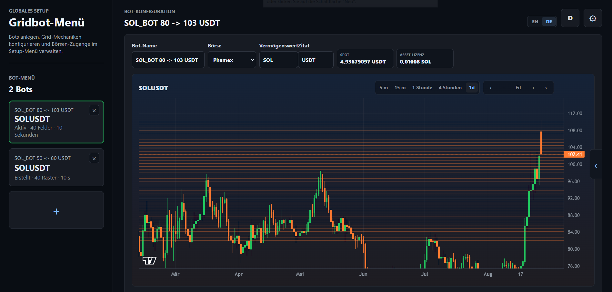
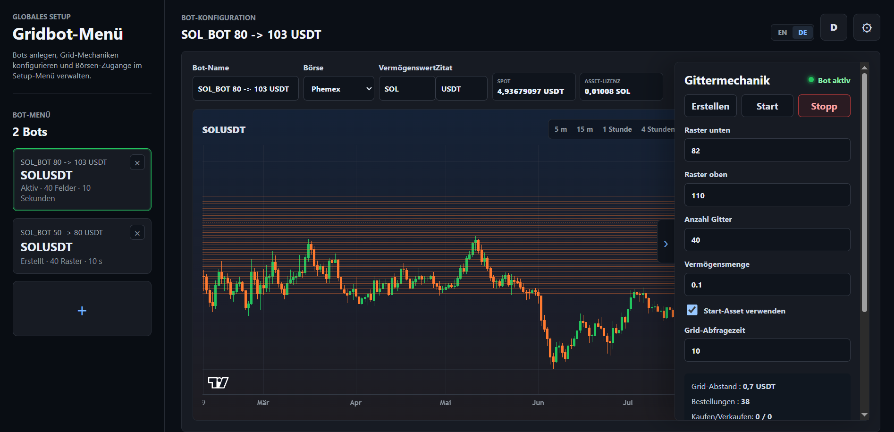

# GRIDBOT CONSOLE

GRIDBOT CONSOLE ist eine lokale Weboberfläche für die Entwicklung und Steuerung einer Grid-Bot-Mechanik. Die Anwendung kombiniert Bot-Konfiguration, Chartansicht, Guthabenanzeige, Grid-Menü, Orderplan und Debug-Ansicht in einer kompakten Arbeitskonsole.

Die Mechanik ist in getrennte Bausteine aufgeteilt. Dadurch können Grid-Erstellung, Orderüberwachung und Schutzregeln einzeln geprüft und weiterentwickelt werden.

## Vorschau

### Overlay



### Overlay mit geöffnetem Grid-Menü



## Funktionen

- Lokale Weboberfläche mit React und Vite
- Lokaler API-Server für Bot-Daten und Phemex-Abfragen
- Speicherung der Bot-Parameter in `data/store.json`
- Phemex-Konfiguration über `.env`
- Chartansicht mit mehreren Intervallen
- Grid-Erstellung als separater Funktionsbaustein
- Orderüberwachung als separater Funktionsbaustein
- Schutz gegen Doppelorders
- Mindestabstand-Regel für Orderplatzierungen
- Start-Asset-Option für vorhandenes Asset-Guthaben
- Deutsch-/Englisch-Umschaltung der Oberfläche

## Projektstruktur

```text
.
├── Bilder/
│   ├── bild_1_Overlay.PNG
│   └── bild_2_Grid_Menu.PNG
├── Grid-Bot-Bausteine/
├── data/
│   └── store.json
├── scripts/
│   └── dev.mjs
├── server/
│   ├── phemexCreateGrid.mjs
│   └── phemexMonitor.mjs
├── src/
│   ├── App.tsx
│   ├── App.css
│   └── MarketChart.tsx
├── server.mjs
├── start-gridbot-menu.bat
└── README.md
```

## Lokaler Start

```bash
npm install
npm run dev
```

Weboberfläche:

```text
http://127.0.0.1:5173
```

API-Server:

```text
http://127.0.0.1:5174
```

Unter Windows kann die Anwendung auch über diese Datei gestartet werden:

```text
start-gridbot-menu.bat
```

## Build

```bash
npm run build
```

## Konfiguration

Die Phemex-Zugangsdaten werden lokal über eine `.env` Datei bereitgestellt.

```text
PHEMEX_API_KEY=
PHEMEX_API_SECRET=
PHEMEX_PASSPHRASE=
```

## Bausteine

- Bot-Start und Initialisierung
- Datenabfrage für Preis und Guthaben
- Grid-Level-Berechnung
- Grid-Erstellung
- Orderprüfung
- Buy-Abholung und Sperre
- Sell-Folgeorder
- Sell-Abholung und Freigabe
- Doppelorder-Blockierung
- Testplan

